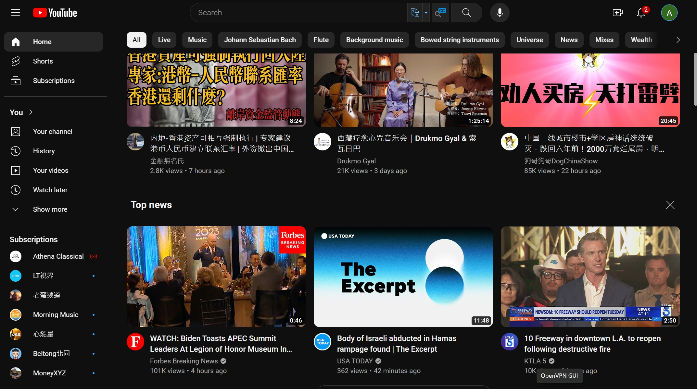

## 为什么这次对了？做对了什么？

看用户行为，不是随意点击进来，看一眼就走人，而是实实在在在使用，各种问题五花八门。而且不少是长期、反复使用。看用户增长，仅仅很少的分享链接就引爆用户量，增速持续走高，而且是加速。

而且，这才是微小的开始，准备了好多新东西还没拿出来，更劲爆的在后面。

因为双方的封锁，因为国内的贫困，也导致了免费的东西畅销。

而且用户访问时间与国内作息时间一致，说明是真实的人在使用。

做对了什么？

其他也有类似的网站，还不少，为什么用户追捧这里，原因只能做猜测：

1. 真实可用。多数网站是挂羊头卖狗肉，我这里是实实在在可用。
2. 稳定。
3. 免费。
4. 无需登录注册，这个恐怕只此一家。因此我猜测，登录注册的门槛会阻止很多潜在用户。

另外一点，目前看来是宣传网站的功劳最大，后面继续观察，到底它的作用是不是压倒其他因素的作用。

## 房间的情感功能

当AI能记住之前话，这个AI的情感功能无敌了，人们会不断重返房间，必定如此。

## Web application

在 Chrome 中已经可以显示每个 tab （网站）所使用的内存大小，这让每个 tab 更像一个应用。

## 计费系统

它是核心之一，因为大模型的计费形式多种，多用户管理复杂。

## The Default Room

每个用户，无论是注册用户还是匿名用户，都拥有一个默认房间 Playground。于是有了一个公开的免费使用的房间，用户点击进入，直接就可以和GPT聊天，没有什么注册、登录、绑卡等等过程。而且，聊天室的概念清晰简单，人人一看就懂。

从这里，我仿佛再一次从头开始设计 Airoom.

## Prisma

[Performance: How to make prisma perform a single SQL query with joins instead of multiple queries](https://github.com/prisma/prisma/discussions/12715)

## 客户端生成ID

[Client-Generated IDs vs. Server-Generated IDs](https://www.techyourchance.com/client-generated-ids-vs-server-generated-ids/)

[Why your software should use UUIDs](https://devforth.io/blog/why-your-software-should-use-uuids/)

## 密码工具箱

[使用 Web Crypto API 打造“密码学家的工具箱”](https://roubin.me/web-crypto-api-introduction/)

## Assis API

[Tutorial: Get started with the new OpenAI Assistants API](https://medium.com/@ralfelfving/tutorial-get-started-with-the-new-openai-assistants-api-7049c2517bfe)

## ESLint

[How to use ESLint with TypeScript](https://khalilstemmler.com/blogs/typescript/eslint-for-typescript/)

## Dto

[How To Use DTO For Validation in NestJS (2022)](https://betterprogramming.pub/how-to-use-data-transfer-objects-dto-for-validation-in-nest-js-7ff95309f650)

## 绝配

看 GPTs 创建过程，其中每一步都有太多的内容可以扩展，因此 OpenAI 目前在此所做的 GPTs 还十分单薄，GPT store 未来应该不是这个样子。

Airoom 和 Assistant API 是绝配，功能递进层级应该是这样：

- Rooms (AI workflow)
  - GPTs (Assistants)
    - LLMs

update: 奥特曼被解职了，下面这个评价很深刻：

I could barely watch the keynote. It was just another bland corp-speak bunch of product updates.

For those researchers I know that were involved from the beginning, this must have felt nausea-inducing.

## Making Assistants UI

界面参考：[How to build your own custom ChatGPT with OpenAI's GPT builder](https://zapier.com/blog/custom-chatgpt/)

## AI Agents

[AI Agent的千亿美金问题：如何重构10亿知识工作职业，掀起软件生产革命？](https://mp.weixin.qq.com/s/JYu_oXWbWbasT1fcBRo-cA)

## Room = Thread

不是给每个用户创建一个 Tread，而是一个房间对应一个 Thread，一个房间里只有一个会话。当你进入一个房间后，在房间里的 GPT 能记住之前的对话，就像它一直在房间等候一样，这很直观。

用户选择模型或助手，然后创建房间，在房间里聊天，这个流程完全吻合直觉。这个模式注定要成功，因为它足够简单，又不是过分简单。它将直觉能够接受的结构赋予LLM使用界面，而且这是一个富有弹性的结构。

## AIROOM 首页

airoom 首页可以参考 Youtube，很贴切。

但有一点要改进：标题和主要信息应该放在头部，而不是底部。图片不是最重要的，最重要的是标题和主要信息。把主要信息放到底部，看着费劲。

> 可视化：
> 把每个模型、助手、房间放到网页上，而不是通过下拉列表来选择，这样有更好的展示性，如果书店把书的封面展示一样。

